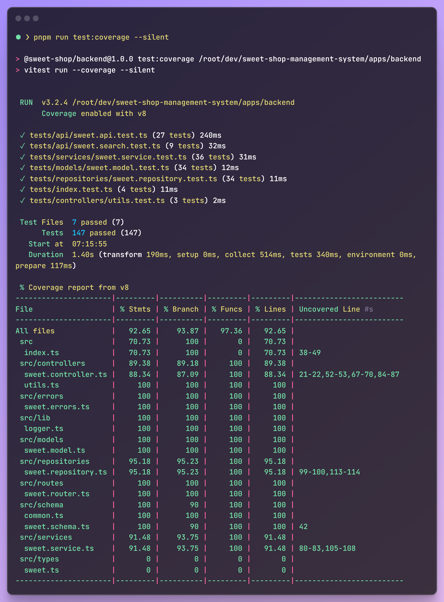

# Sweet Shop Management System

A full-stack Sweet Shop Management System built with TypeScript, following Test-Driven Development (TDD) principles.

- In this project, I have used AI tools ([sst/opencode](https://github.com/sst/opencode)) to help with tests generation. Commits related to AI-generated tests are marked with `[AI]` in the commit message. I have also used GitHub Copilot to assist with code suggestions throughout the development process.

## Features

- **TDD** (Test-Driven Development) approach
- **High test coverage** (over 92%) (See [coverage report](./test-report.png))
- **CI/CD** pipeline with GitHub Actions
- **Containerized** with Docker
- **Modern tech stack** with TypeScript, Express, React, and Vite
- **Monorepo** structure for better organization

## Overview

This is a monorepo containing:

- **Backend** (`apps/backend/`): Node.js REST API with Express, TypeScript, and Vitest for testing
  - Express for the REST API
  - TypeScript for type safety
  - Vitest for unit and integration testing (Why Vitest? It's fast, modern, and has great TypeScript support)
  - (TODO) Use SQLite for data storage
- **Frontend** (`apps/frontend/`): React application with Vite, TypeScript, and modern tooling
  - Vite for fast development and build
  - TypeScript for type safety
  - React for building user interfaces
  - (TODO) Add E2E testing with Playwright

## Getting Started

### Option 1: Run with Docker (Production Build) (Preferred)

#### Prerequisites

- Docker installed and running

#### Using GitHub Container Registry

```bash
# Pull the latest image
docker pull ghcr.io/mdhruvil/sweet-shop-management-system:latest

# Run the container
docker run -p 3000:3000 ghcr.io/mdhruvil/sweet-shop-management-system:latest
```

#### Build locally

```bash
# Build the image locally
docker build -t sweet-shop .

# Run the container
docker run -p 3000:3000 sweet-shop
```

The application will be available at http://localhost:3000

> **Note:** Docker runs the production build with both frontend and backend served from a single container. Use pnpm for development.

### Option 2: Local Development with pnpm

#### Prerequisites

- Node.js >=24.0.0
- pnpm 10.12.4 or higher

#### Installation

```bash
# Install all dependencies for both frontend and backend
pnpm install

# Start both frontend and backend in development mode
pnpm dev

#OR
# Start only the backend
pnpm --filter backend dev

# Start only the frontend
pnpm --filter frontend dev
```

The development server will start:

- Frontend: http://localhost:5173 (Vite dev server with hot reload)
- Backend: http://localhost:3000 (Express API with hot reload)

## Coverage Report



## Development

This project follows TDD principles. Write tests first, then implement functionality.

## License

MIT
